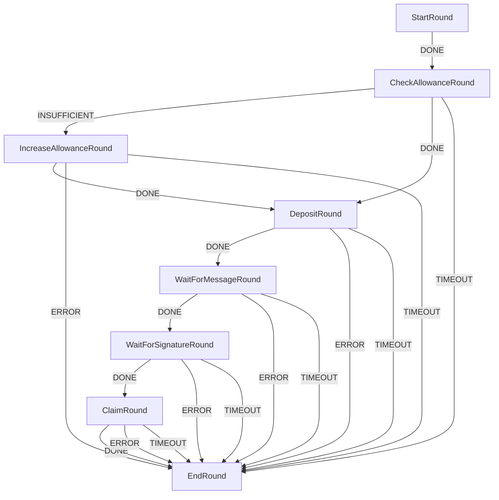

# Gnosis Bridging Skill

## Description

This bridging skill moves funds between different chains.

```mermaid
graph TD
  StartRound
  DepositRound
  CheckAllowanceRound
  StartRound
  WaitForMessageRound
  EndRound
  ClaimRound
  WaitForSignatureRound
  IncreaseAllowanceRound
  CheckAllowanceRound -->|INSUFFICIENT| IncreaseAllowanceRound
  CheckAllowanceRound -->|DONE| DepositRound
  CheckAllowanceRound -->|TIMEOUT| EndRound
  DepositRound -->|DONE| WaitForMessageRound
  DepositRound -->|ERROR| EndRound
  DepositRound -->|TIMEOUT| EndRound
  ClaimRound -->|DONE| EndRound
  ClaimRound -->|ERROR| EndRound
  ClaimRound -->|TIMEOUT| EndRound
  IncreaseAllowanceRound -->|DONE| DepositRound
  IncreaseAllowanceRound -->|ERROR| EndRound
  IncreaseAllowanceRound -->|TIMEOUT| EndRound
  StartRound -->|DONE| CheckAllowanceRound
  WaitForMessageRound -->|DONE| WaitForSignatureRound
  WaitForMessageRound -->|ERROR| EndRound
  WaitForMessageRound -->|TIMEOUT| EndRound
  WaitForSignatureRound -->|DONE| ClaimRound
  WaitForSignatureRound -->|ERROR| EndRound
  WaitForSignatureRound -->|TIMEOUT| EndRound
```

Bridging requests can be submitted and awaited back and forth between `l1` and `l2`.

